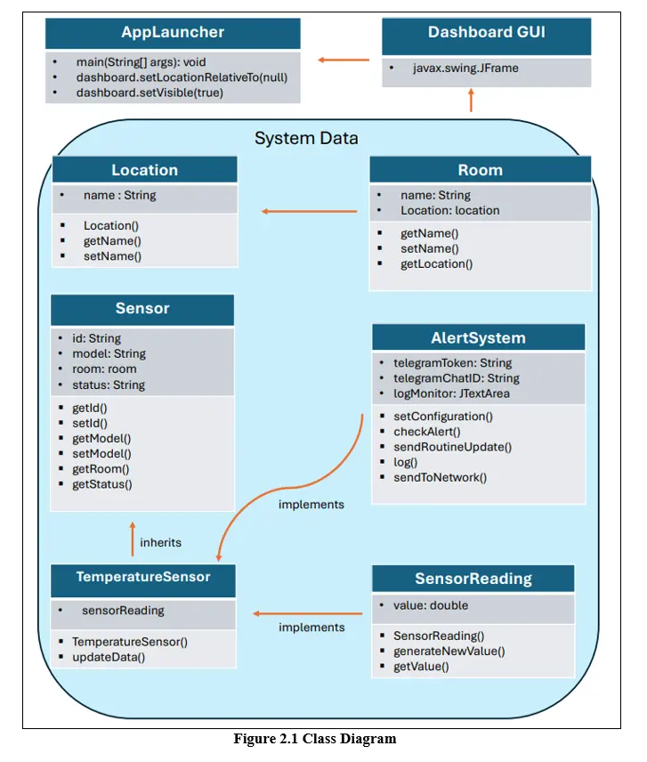
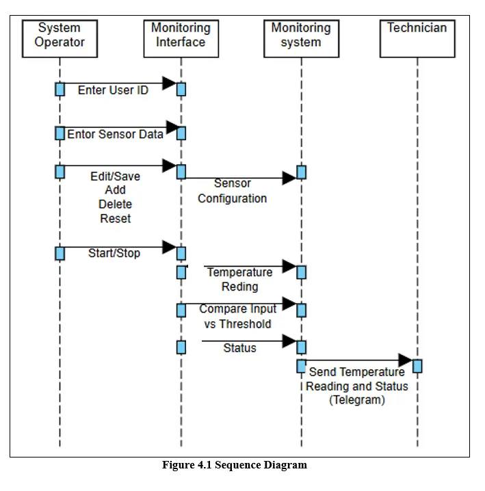
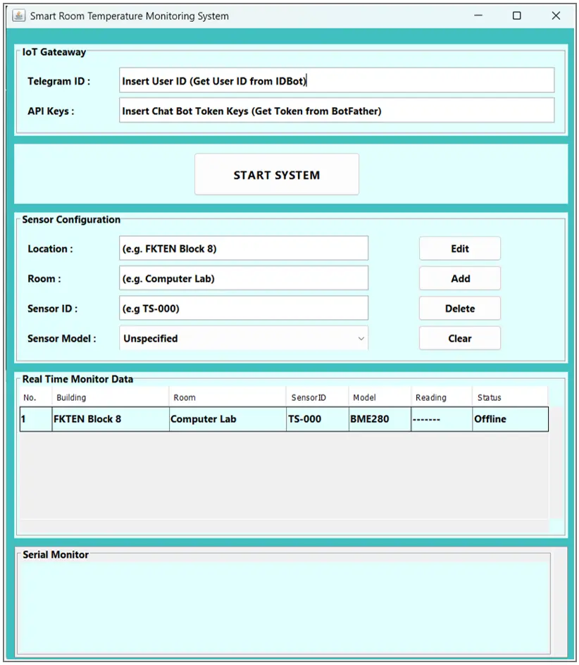
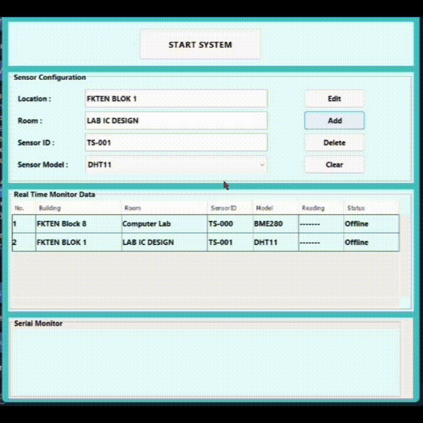

**🌡️ NMK20703 OOP Mini-Project: Smart Room Temperature Monitoring System**

## 📑 Table of Contents
* [Project Overview](#overview)
* [Technical Architecture](#architecture)
* [System Operations & GUI Features](#gui-features)
* [Conclusion](#conclusion)
* [How to Run the Application](#how-to-run)

## 📖 Project Overview
This repository details the design and implementation of a Smart Laboratory Temperature Monitoring System, developed as part of the Object-Oriented Programming (NMK20703) undergraduate course.

This application was developed in a Java environment to monitor and manage temperature conditions in real-time. Maintaining an appropriate laboratory and server room temperature is crucial to ensure the safety of equipment, as even minor temperature shifts can cause hardware damage or affect sensitive performance. The system acts as a digital watchdog and successfully integrates core Object-Oriented Programming principles, including:

`Encapsulation` (Protecting sensor data)

`Inheritance` (Extending generic sensors)

`Abstraction` (Defining core system behaviors)

`Polymorphism` (Dynamic alert handling)

  
Click here to view the Class Diagram

   
  

[⬆️ Back to Table of Contents](#toc)
  
## 🏗️ Technical Architecture

The system is built entirely using Java and Swing, demonstrating a highly modular and scalable design. The architecture consists of the following core concepts:

  
Click here to view the Sequence Diagram

   
  

  
`🔒 Encapsulation (Data Protection):`
Enforced throughout the system to protect sensitive sensor data from direct external access and modification.

`🧬 Inheritance (Sensor Hierarchies):`
Implemented by extending a generic, abstract sensor base class into highly specific temperature sensor subclasses.

`🔀 Polymorphism (Dynamic Alerts):`
Applied to dynamically handle different alert mechanisms and notification logic based on varying alert severity levels.

`📡 Telegram API Integration:`
When critical thermal limits are breached, the system ensures rapid intervention by triggering simulated HTTP requests to the Telegram API for mobile notifications.

[⬆️ Back to Table of Contents](#toc)

## 🖥️ System Operations & GUI Features
Transitioning this design into a user-friendly application required creating a robust interface capable of handling live updates, preventing user errors, and diagnosing connection issues. 

  
Click here to view the GUI

   
  

  
`🛡️ Smart Sensor ID Checker & Auto-Rename:`
When adding a new sensor to the network, the system actively checks for ID conflicts. If a duplicate Sensor ID is detected, you don't have to worry about the system crashing since it uses a smart auto-rename feature to uniquely adjust the ID, preventing data collision.

`🪞 Smart Mirroring Quick-Edit:`
Clicking any existing sensor row inside the data table instantly mirrors its data back into the configuration panel! This allows operators to quickly edit a misconfigured sensor or rapidly duplicate settings for new rooms without retyping everything.

`📊 Real-Time Status Categorization:`
By analyzing data continuously, the dashboard instantly categorizes room conditions into Safe, Warning, or Critical states to identify overheating risks. 

`🖥️ Serial Monitor Diagnostics:`
The localized terminal log at the bottom of the dashboard doesn't just show successes. It acts as your primary diagnostic tool. If an alert fails to send to the Telegram server (due to an invalid API key, network error, or timeout), the system catches the exception and prints the exact warning or error to the serial monitor so technicians can troubleshoot immediately.

## 🎓 Conclusion
The construction of this Smart Monitoring System demonstrates the highly effective application of OOP to create a robust "digital watchdog" that secures critical environments. This automated oversight removes human error and ensures rapid intervention via the Telegram Messaging API, preventing catastrophic hardware failures. While the current functional prototype uses simulated data, it establishes a solid architectural foundation for future iterations involving persistent SQL data logging and real-time physical IoT hardware sensors.

[⬆️ Back to Table of Contents](#toc)

## 🚀 How to Run the Application
Testing this Java Swing application is incredibly straightforward.

Option A
1. Download or clone this repository to your local machine.
2. Ensure you have the **Java JDK** installed. 
3. Locate the `src/GUI` folder containing the four core files:
   * `Main.java` (The entry point)
   * `DashboardGUI.java` (The main UI logic)
   * `SystemData.java` (The simulated sensor and OOP class logic)
   * `DashboardGUI.form` (The NetBeans UI builder file)
4. **Option A (IDE):** Open the project in Apache NetBeans (recommended, as it utilizes the `.form` file to render the visual GUI editor). Run the main file.
5. **Option B (Terminal):** Open your command prompt/terminal in the directory containing the files, compile using `javac *.java`, and execute the application by typing `java AppLauncher` (or `java Main` depending on your main class name).
6. Insert your Telegram credentials, add a sensor, and hit **START SYSTEM** to watch the data flow!

Option B: Run Online via AI Cloud IDE (No Installation Required)
If you prefer not to install Java locally, you can run the GUI directly in your browser using an online AI-powered IDE like [Blackbox AI / Replit / Project IDX].

1. Open your preferred online Java simulator workspace.

2. Create three new Java files in the online environment: Main.java, DashboardGUI.java, and SystemData.java.

3. Copy and paste the raw code from this repository into their respective files. (Note: Online simulators process the raw code, so the .form file is not required).

4. Hit the Run button. The cloud environment will compile the code and simulate the graphical interface directly on your screen.

5. Insert your Telegram credentials into the virtual window to test the live data flow!

  
Click here to view Simulation

  

[⬆️ Back to Table of Contents](#toc)
